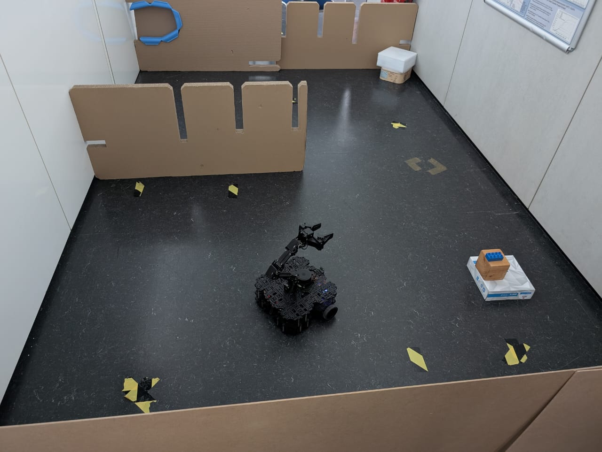

# TurtleBot3 Autonomous Navigation and Manipulation

A complete robotic pipeline using TurtleBot3 Waffle Pi with OpenManipulator X and ROS2 Humble for autonomous navigation, object detection, and manipulation.




## Project Overview

This project implements an autonomous robotic system that can:
- **Explore** unknown indoor environments using SLAM
- **Navigate** autonomously to goal positions
- **Detect** objects by shape and color using YOLO
- **Localize** objects in 3D using sensor fusion (LiDAR + camera)
- **Pick** objects using the OpenManipulator X arm
- **Place** objects at predefined locations

## Hardware Requirements

- **TurtleBot3 Waffle Pi** with:
  - 2D LiDAR sensor (LDS-02)
  - RGB camera (Raspberry Pi Camera Module v2)
  - OpenManipulator X robotic arm
  - Raspberry Pi 4B (4GB RAM recommended)
- **Remote PC** (Ubuntu 22.04) for development and monitoring

## Software Requirements

- **OS**: Ubuntu 22.04 LTS
- **ROS**: ROS2 Humble Hawksbill
- **Python**: 3.10+
- **Additional Dependencies**:
  - `cartographer_ros`
  - `navigation2`
  - `moveit2`
  - `turtlebot3` & `turtlebot3_manipulation`

---

## Installation [Remote PC]

### 1. Install Dependent ROS 2 Packages

Open a terminal on the **Remote PC** (`Ctrl+Alt+T`) and run:
```bash
# Install Gazebo
sudo apt install ros-humble-gazebo-*

# Install Cartographer (for SLAM)
sudo apt install ros-humble-cartographer
sudo apt install ros-humble-cartographer-ros

# Install Navigation2 Stack
sudo apt install ros-humble-navigation2
sudo apt install ros-humble-nav2-bringup
```

### 2. Install TurtleBot3 Packages

```bash
source /opt/ros/humble/setup.bash
mkdir -p ~/turtlebot3_ws/src
cd ~/turtlebot3_ws/src/

# Clone required packages
git clone -b humble https://github.com/ROBOTIS-GIT/DynamixelSDK.git
git clone -b humble https://github.com/ROBOTIS-GIT/turtlebot3_msgs.git
git clone -b humble https://github.com/ROBOTIS-GIT/turtlebot3.git

# Install dependencies
sudo apt install python3-colcon-common-extensions
sudo apt install ros-humble-dynamixel-sdk ros-humble-ros2-control \
                 ros-humble-ros2-controllers ros-humble-gripper-controllers \
                 ros-humble-moveit*

# Clone the manipulation packages
git clone -b humble https://github.com/ROBOTIS-GIT/turtlebot3_manipulation.git

# Build the workspace
cd ~/turtlebot3_ws
colcon build --symlink-install

# Source the workspace
echo 'source ~/turtlebot3_ws/install/setup.bash' >> ~/.bashrc
source ~/.bashrc
```

### 3. Add the package `tb3_autonomous_pick_place` to src

Clone this repository and copy the relevant folder:
```bash
# Clone the group repository (separately, outside the workspace)
cd ~
git clone https://github.tik.uni-stuttgart.de/IAS-ROSLab/Group_2.git

# Copy the specific task directory into your workspace
cp -r ~/Group_2/main/main_task/tb3_autonomous_pick_place ~/turtlebot3_ws/src/

cd ~/turtlebot3_ws/
# Build and source the workspace
colcon build --symlink-install
source install/setup.bash
```

### 4. Environment Configuration
Configure environment variables on the Remote PC:
```bash
echo 'export ROS_DOMAIN_ID=30 #TURTLEBOT3' >> ~/.bashrc
echo 'export RMW_IMPLEMENTATION=rmw_fastrtps_cpp' >> ~/.bashrc
echo 'export TURTLEBOT3_MODEL=waffle_pi' >> ~/.bashrc
echo 'source /usr/share/gazebo/setup.sh' >> ~/.bashrc
echo 'source /opt/ros/humble/setup.bash' >> ~/.bashrc
source ~/.bashrc
```

### Project Directory Structure
```bash

turtlebot3_ws/
├── src/
│   ├── turtlebot3/                 
│   ├── turtlebot3_msgs/           
│   ├── turtlebot3_manipulation/   
│   ├── DynamixelSDK/              
│   └── tb3_autonomous_pick_place/              
├── install/
└── build/

```
---
## TurtleBot3 SBC Setup [Raspberry Pi]

### 1. Connect via SSH from Remote PC
```bash
ssh ubuntu@<IP_ADDRESS_OF_TURTLEBOT3>
```
### 2. Install ROS 2 Manipulation Packages

Follow official SBC setup instructions:
📄 https://emanual.robotis.com/docs/en/platform/turtlebot3/sbc_setup/#sbc-setup
```bash
sudo apt update
sudo apt install ros-humble-hardware-interface ros-humble-xacro \
                 ros-humble-ros2-control ros-humble-ros2-controllers \
                 ros-humble-gripper-controllers

# Setup workspace
source /opt/ros/humble/setup.bash
mkdir -p ~/turtlebot3_ws/src
cd ~/turtlebot3_ws/src/
git clone -b humble https://github.com/ROBOTIS-GIT/turtlebot3_manipulation.git

cd ~/turtlebot3_ws
colcon build --symlink-install
```

### 3. Configure Environment Variables
```bash
echo 'export ROS_DOMAIN_ID=30 #TURTLEBOT3' >> ~/.bashrc
echo 'export RMW_IMPLEMENTATION=rmw_fastrtps_cpp' >> ~/.bashrc
echo 'export TURTLEBOT3_MODEL=waffle_pi' >> ~/.bashrc
echo 'source /opt/ros/humble/setup.bash' >> ~/.bashrc
source ~/.bashrc
```
---
## Launch

**[SBC]**

Start Hardware Bringup and Camera Node in separate terminals
```bash
ros2 launch turtlebot3_manipulation_bringup hardware.launch.py
```
```bash
ros2 run v4l2_camera v4l2_camera_node
```

**[Remote PC]**

Launch all the files in separate terminals

```bash
ros2 launch turtlebot3_manipulation_moveit_config moveit_core.launch.py
```
```bash
ros2 launch turtlebot3_cartographer cartographer.launch.py
```
```bash
ros2 launch turtlebot3_navigation2 navigation2.launch.py
```
```bash
ros2 run tb3_autonomous_pick_place frontier_node
```
```bash
ros2 launch tb3_autonomous_pick_place nodes.launch.py
```

---
## References

TurtleBot3 Manual: https://emanual.robotis.com/docs/en/platform/turtlebot3/overview/

ROS 2 (Humble) Documentation: https://docs.ros.org/en/humble/
